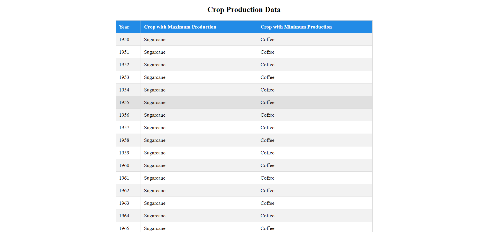
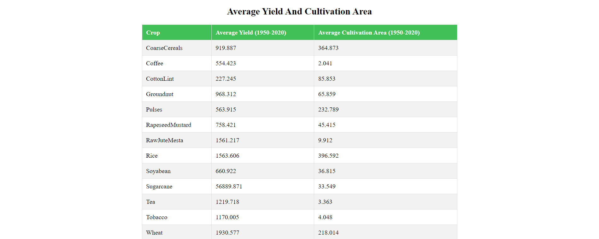

# Indian Agriculture Analytics

This project performs analytics over the Indian Agriculture dataset and displays them as tables.

## Installation

1. Clone the repository
2. Navigate to the project directory
3. Run `yarn install` to install dependencies
4. Run `yarn start` to start the project

## Screenshots

### Yearly Max/Min Production Table

### Crop Average Yield and Area Table

